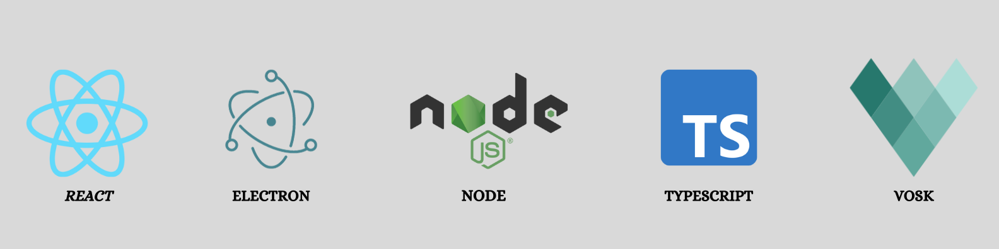
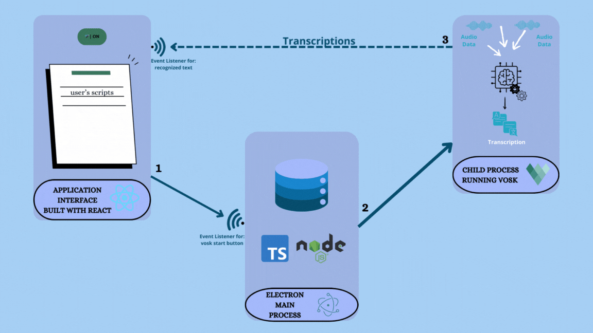

## السَّلامُ عَلَيْكُم ورَحْمَةُ اللهِ وَبَرَكاتُهُ

## مسجل القراءة الذكي || Mushajil al-Qira'ah al-Dhaki

## اقرأ ارتقِ بصوتك

## Introduction

"Mushajil al-Qira'ah al-Dhaki" is a desktop application that allows new learners especially children to practice reading
passages while recording their voice.
The AI technology instantly analyzes their speech, providing detailed feedback on spelling and other aspects of spoken
language.
This immediate feedback loop enables learners to identify areas for improvement quickly and track their progress over
time.

The application provide :

* Support up to 30 languages:Enables learners to practice in their native language or any language they wish to learn,
  promoting inclusivity and engagement.

* Real instant feedback by AI:Provides immediate insights on spelling , facilitating quick adjustments and reinforcing
  correct language usage.

* Speech analysis: Offers detailed feedback on spelling mistakes, and rhythm, helping learners refine their speaking
  skills and develop accurate reading patterns.

* Progress tracking: Allows learners to monitor their development over time, providing a clear understanding of
  strengths
  and weaknesses and facilitating focused efforts on areas needing improvement.

## Technologies Used

Those are the main technologies used in this project:


## Architecture



1. After uploading a script, the user initiates the process by clicking the "Start" button.
2. The main process launches a child process to run Vosk, triggered by an event listener for the click.
3. Vosk transcribes audio from the microphone, sending the results to the renderer process. <br>
   The renderer process, equipped with an event listener, then compares the transcribed text with the uploaded script.

## Installation

1. Make sure to have Node.js installed on your machine
   You can install it using this link here [https://nodejs.org/en/download/](https://nodejs.org/en/download/)

2. Clone the repo from GitHub using the following command
   ```sh
   git clone https://github.com/NidhalNaffati/hackathon-ramadan-2024.git
   ```
3. Install NPM packages
   ```sh
    cd hackathon-ramadan-2024 && npm install
   ```
4. Install the Vosk model you want to use
   from [https://alphacephei.com/vosk/models](https://alphacephei.com/vosk/models). <br>
5. Make sure to extract the model in the root directory of the project and rename it to `model`

## Usage

1. Run the application with the following command
   ```sh
   npm run dev
   ```

2. Upload the script that you want to read
    1. Write or paste the script in the text area
    2. You can generate a script with an AI assistant like GPT-3.
       for that u have to run the following command
       ```
       cd src
       node proxy_server.js
       ```
3. Click on the start button to start the process
4. Start reading the script and the application will highlight the words that you are reading

# Presentation
https://docs.google.com/presentation/d/1LbK6pRwAsIzlReleLNf4ToDs0YPg3rjsLJSvmspuVEE/edit#slide=id.g2bd619d2532_0_757
